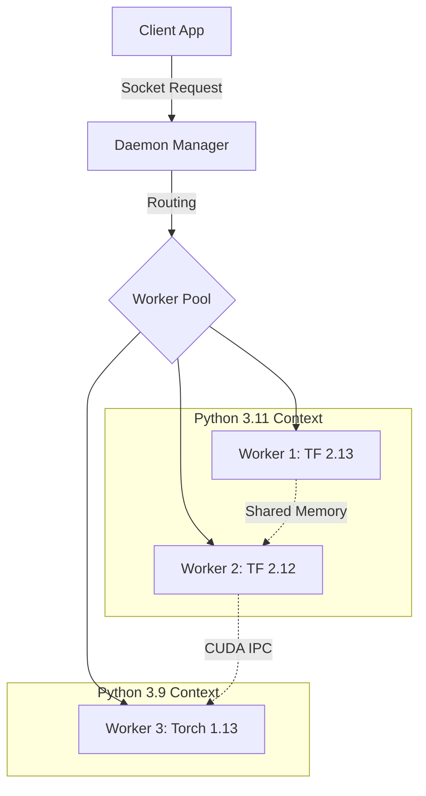

# Deep Dive: The Worker Daemon

## Overview

The **omnipkg Worker Daemon** is a distributed Python runtime hypervisor. Unlike standard virtual environment tools that simply set environment variables, the Daemon maintains a pool of pre-warmed, isolated worker processes across multiple Python interpreters.

It solves the fundamental limitation of Python's import system: **The inability to unload C-extensions.**

While the [Legacy Loader](../advanced_features/runtime_switching.md) operates within a single process (modifying `sys.path`), the Daemon operates across process boundaries, enabling:
1.  **True C-Extension Swapping:** Run TensorFlow 2.12 and 2.13 side-by-side.
2.  **Cross-Interpreter Execution:** Run code in Python 3.9, 3.10, and 3.11 simultaneously.
3.  **Zero-Copy IPC:** Pass data between these isolated worlds in microseconds.

## The "Linker Lock" Problem

Why can't we just unload modules?

When Python imports a package with C-extensions (like `numpy`, `torch`, or `tensorflow`), the operating system's dynamic linker (`ld.so` on Linux, `ntdll` on Windows) maps shared libraries (`.so` / `.dll`) into the process memory.

Python provides no mechanism to force the OS to unload these libraries. Even if you delete the module from `sys.modules`, the symbols remain in memory.

**The Consequence:**
If you try to load `numpy` 1.21, unload it, and then load `numpy` 1.26 in the *same process*, you will trigger symbol conflicts, segmentation faults, or silent data corruption.

**The Daemon Solution:**
The Daemon spawns a separate OS process for every execution context.
*   Worker A loads `numpy-1.21`.
*   Worker B loads `numpy-1.26`.
*   Because they are separate processes, they have separate memory address spaces. The OS linker is happy, and you get total isolation.

## Architecture

The Daemon uses a **Manager-Worker** architecture designed for low latency.



### 1. The Manager
A lightweight process that holds the socket connection. It maintains the registry of active workers and routes requests based on the requested `spec` (e.g., `tensorflow==2.13.0`) and `python_exe`.

### 2. The Worker Pool
Workers are forked processes.
*   **Cold Start:** ~300ms. The worker launches, imports the requested package bubble, and signals readiness.
*   **Hot Execution:** ~2ms. The worker is already alive and resident in memory. It accepts the code payload, executes it, and returns the result immediately.

## Zero-Copy Data Transfer (IPC)

Running code in separate processes usually incurs a heavy penalty: **Serialization**. Sending a 1GB tensor from one process to another typically requires pickling it (CPU heavy) and copying bytes (Memory bandwidth heavy).

Omnipkg bypasses this using **Universal IPC**:

| Mode | Mechanism | Speed (1MB Tensor) | Requirements |
| :--- | :--- | :--- | :--- |
| **Universal CUDA** | `ctypes` pointers | **~2.3ms** | NVIDIA GPU, Any Framework |
| **Native Torch** | `torch.multiprocessing` | ~3.5ms | PyTorch only |
| **CPU SHM** | `SharedMemory` buffer | ~14ms | Any CPU data |

**Universal CUDA IPC** is the default for GPU tensors. It allows a tensor created in TensorFlow 2.13 (Worker A) to be read by PyTorch 2.0 (Worker B) without the data ever leaving GPU VRAM.

## Performance Benchmarks

*Data captured from production benchmarks (Feb 2026).*

| Metric | omnipkg Daemon | Docker Container |
| :--- | :--- | :--- |
| **Hot Execution Latency** | **~2ms** | ~50ms (best case API) |
| **Cold Startup** | **~300ms** | ~2000ms+ |
| **Memory Overhead** | ~330MB (Shared Libs) | ~600MB+ (Duplicated Kernel Space) |
| **Data Transfer** | **Zero-Copy** | Network Serialization Required |

## When to use Which?

Use this decision matrix to choose between the Legacy Loader and the Daemon.

| Feature | Legacy Loader (`omnipkg.loader`) | Worker Daemon (`DaemonClient`) |
| :--- | :--- | :--- |
| **Isolation Mechanism** | `sys.path` manipulation | OS Process Boundary |
| **Speed (Hot)** | ~40ms | **~2ms** |
| **Pure Python Swapping** | ✅ Yes | ✅ Yes |
| **C-Extension Swapping** | ❌ **Impossible** (Linker lock) | ✅ **Supported** |
| **Cross-Python** | ❌ Same interpreter only | ✅ **Any installed Python** |
| **Use Case** | Simple scripts, `rich`, `requests` | AI Pipelines, `numpy`, `torch`, `tf` |

## Usage API

```python
from omnipkg.isolation.worker_daemon import DaemonClient

# 1. Initialize Client (Reusable singleton)
client = DaemonClient()

# 2. Execute Code
result = client.execute_shm(
    spec="tensorflow==2.13.0",           # The environment to use
    code="import tensorflow as tf; print(tf.__version__)", 
    shm_in={},                           # Input data (Zero-Copy)
    shm_out={},                          # Output keys
    python_exe="/path/to/python3.11"     # Specific interpreter
)

print(result['stdout'])
# Output: 2.13.0
```
```

1.  **🧠 `execute_smart()` (Intelligent Dispatch):**
    *   It automatically detects your data type (`torch.Tensor` vs `numpy.ndarray` vs `dict`).
    *   It routes traffic instantly:
        *   **GPU Tensor?** $\to$ `CUDA_IPC` (<5µs)
        *   **Big Array (>64KB)?** $\to$ `CPU_SHM` (~5ms)
        *   **Small Dict?** $\to$ `JSON` (~10ms)
    *   *Marketing claim:* "The user doesn't need to know *how* to send data. Omnipkg just picks the fastest lane."

2.  **⚡ HFT-Grade Concurrency (`execute_optimistic_write`):**
    *   It supports **Hardware Atomics** (`omnipkg_atomic.cas64`)!
    *   It uses **Optimistic Locking** (Spinlocks) instead of slow OS mutexes.
    *   This is designed for High-Frequency Trading (HFT) or real-time inference where waiting for a file lock is too slow.

3.  **🛡️ Cross-Platform Hardening:**
    *   It implements a custom **TCP Handshake for Windows** (since Windows lacks Unix Domain Sockets) via `daemon_connection.txt`.
    *   It prevents infinite recursion loops with `OMNIPKG_DAEMON_CHILD`.

---

```markdown
## Intelligent Dispatch (`execute_smart`)

The Daemon isn't just a raw execution engine; it includes an intelligent router that analyzes payload characteristics to select the optimal transport mechanism automatically.

| Input Data | Trigger Condition | Transport Used | Latency |
| :--- | :--- | :--- | :--- |
| **GPU Tensor** | `is_cuda=True` | **Universal CUDA IPC** | **< 5µs** |
| **Large Array** | `numpy` > 64KB | **Zero-Copy SHM** | ~5ms |
| **Config/Text** | JSON serializable | Standard Socket | ~10ms |

**Usage:**
```python
# You don't need to choose the method manually:
result = client.execute_smart(
    spec="tensorflow==2.13.0",
    code="...",
    data=my_huge_tensor  # omnipkg detects this is GPU data and uses IPC
)
```

## HFT-Grade Concurrency

For high-frequency state synchronization (e.g., shared model weights or configuration flags), the Daemon implements **Optimistic Locking** with hardware atomics.

*   **Standard Mode:** Uses file locks (robust but slow).
*   **Atomic Mode:** Uses `omnipkg_atomic.cas64` (Compare-And-Swap) for lock-free synchronization on supported CPUs.

This allows workers to read shared state without blocking, only retrying if a write collision actually occurs (Optimistic Concurrency Control).